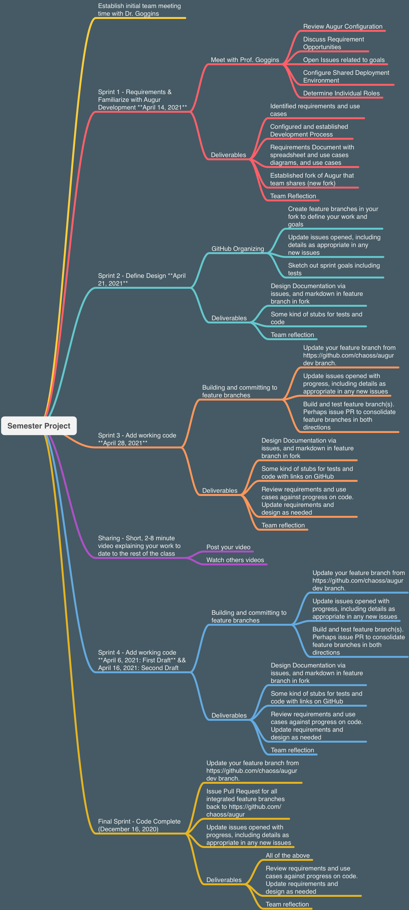

# Semester Project

## Schedule and Deliverable Overview

### Its not complicated. 

### Overview in Text
1. Sprint 1: Requirements/Deployment setup (Requirements document, link to deployed server) **Deployed Server Only Requires a Link to the Augur API Endpoint http://myaugur.com/api/unstable/repos .**
2. Sprint 2: Design (Fully fleshed out design. What are you going to build. As much detail as possible)
3. Sprint 3: Code and Testing Iteration 1 (At least a "Hello World")
4. Sprint 4: Code and Tesinng Iteration 2 (Your final product) [if you build notebooks, using https://github.com/augur/augur-community-reports, your final submission should include a running version of an exported Python program.]

## What You Turn In For Every Module: 
1. A link to a GitHub Repository, which should contain: 
  - A README.md file that explains how to deploy your code (if you add/change things from usual, otherwise this is probably a copy of Augur's readme.md)
  - A Progress Report, which will be some kind indication about whether or not you need to update your scope. 
2. There should be a branch each for sprint 1, sprint 2, sprint 3, and sprint 4. The finished product for each sprint for each module should be in that branch unchanged.
3. The main branch should contain the *most recently turned in sprint*
4. For each sprint, include any explanation of obstacles you encountered, reflections, and goals

## Setting up student meeting times
1. Each team must have one deployment server that I can access to see their latest deployments, and a named GitHub Repository that is shared with me so I can monitor your development activity.  
2. Each team will define a set of requirements for their project. There are a number of possibilities for working with Augur, and the publicly available dataset I will share with you. In addition to the Augur repository at https://github.com/chaoss/augur you may consider using the Jupyter Notebooks at https://github.com/chaoss/augur-community-reports to work things out. 
3. **SIGN UP REQUIRED** Each team must meet with me between April 8, and April 14. Your **TEAM** can sign up here (MAKE SURE you can all be there at the time you sign up for): https://docs.google.com/spreadsheets/d/1zHhADSuvoc7Opl4WcjmIJXKWnDrBgveO2EbEFdk2ABA/edit?usp=sharing Each team should plan for 30 minutes. Times I have set aside right now are: 
    - Thursday, April 8: 1pm - 5pm
    - Friday, April 9: 12pm - 2pm, and 3pm - 5pm 
    - Sunday, April 11: 4pm - 6pm 
    - Monday, April 12: 12pm - 2pm, and 3pm - 6pm 
4. If you want your own copy of populated Augur data to work with, a test database with Augur data in it from 92 open source scientific software packages is available upon request.  It will have data from a set of 92 Scientific Open Source Software Projects. **There are three repositories you can use in different combinations to address the requirements for your project.**
    - https://github.com/chaoss/augur (required)
    - https://github.com/chaoss/augur-community-reports 
    - https://github.com/chaoss/augur-spdx 
5. There are related projects that you may consider incorporating into Augur as well. These include: 
    - https://deps.cloud/ -- They need a PyPi dependency collector at the moment
    - https://github.com/indeedeng/Mariner-Issue-Collector - Here, you could take a list of GitHub repositories from an Augur instance and gather information on issues recently opened. 

## Resources for Getting Started and Requirements (All groups need at least one use case, including the diagram. Some groups may be able to more easily express the details of their requirements narratively or in the spreadsheet template from module 3)
 - [Use Case Template](./_use-case-template.md)
 - [Requirements Template from Module 3](https://github.com/MUSoftwareEngineering/CS-4320/blob/master/03-requirements/readings/requirements-template.xlsx)

### Augur Software

1. [Augur Documentation](https://oss-augur.readthedocs.io/en/dev/)
2. [Augur Community Reports Repo](https://github.com/chaoss/augur-community-reports)
3. http://augur.osshealth.io:5055/api/unstable/repos
4. [Contributor Analysis from augur-community-reports](https://docs.google.com/presentation/d/1rLuEROyKlujjPd9AEQ5z1v0V1WPYagv454SBHFNpRDU/edit#slide=id.g8b77fbdb00_0_5)

### Augur Documentation
1. [Conceptual Overview of Augur Data](http://www.augurlabs.io/under-the-hood-with-augurs-data/)
2. [Augur's Full, physical data model](http://www.augurlabs.io/augurs-full-physical-data-model/)
3. [Creating an Augur Worker](http://www.augurlabs.io/learn-how-to-create-an-augur-worker/)
4. [CHAOSS Committers Metrics](https://chaoss.community/metric-committers/)
5. [CHAOSS Risk Metrics](https://chaoss.community/metrics/#user-content-focus-area---business-risk)
6. [Currently open Augur Issues](https://github.com/chaoss/augur/issues)

### Candidate Ideas
0. [Metrics Currently Under Development That You Could Create EndPoints For](https://docs.google.com/spreadsheets/d/1tAGzUiZ9jdORKCnoDQJkOU8tQsZDCZVjcWqXYOSAFmE/edit#gid=1004270137)... you can see the context for these in the working groups themselves: 
 - Look at the repos for the five working groups, and see what's in development, or been discussed.  They are at https://github.com/chaoss/wg-{Group Name} 
 - https://github.com/chaoss/wg-risk
 - https://github.com/chaoss/wg-evolution
 - https://github.com/chaoss/wg-value
 - https://github.com/chaoss/wg-common
 - https://github.com/chaoss/wg-diversity-inclusion
2. or simply develop Jupyter Notebooks for
3. Front end fixes
4. Debugging and deploying machine learning workers (gsoc-dev branch)
5. Ecosystem Level Queries and Analysis
6. Documentation Updates, especially developer instructions
7. Containerization of augur-spdx
8. Frontend redesign or new front end using tools like Graphana 
9. Many, many more to discuss!
10. ### Looking for Requirements? 
11. Look at https://chaoss.community/metrics
12. Message Goggins

